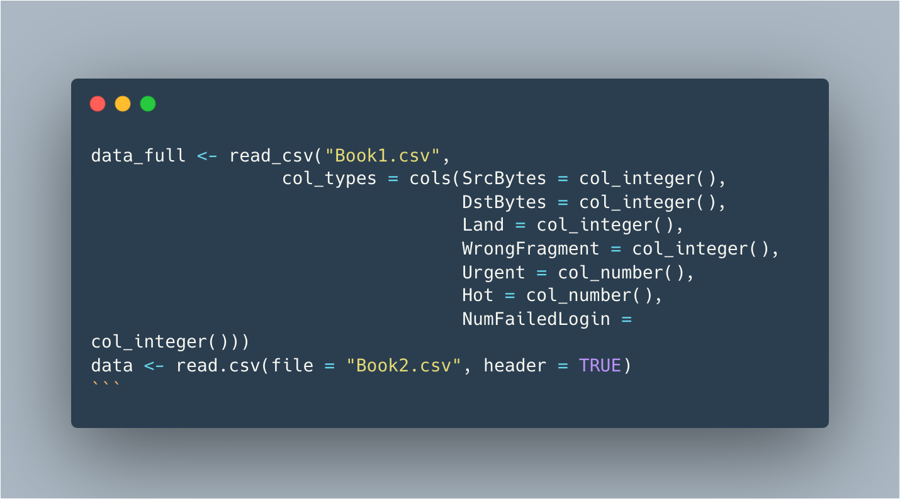
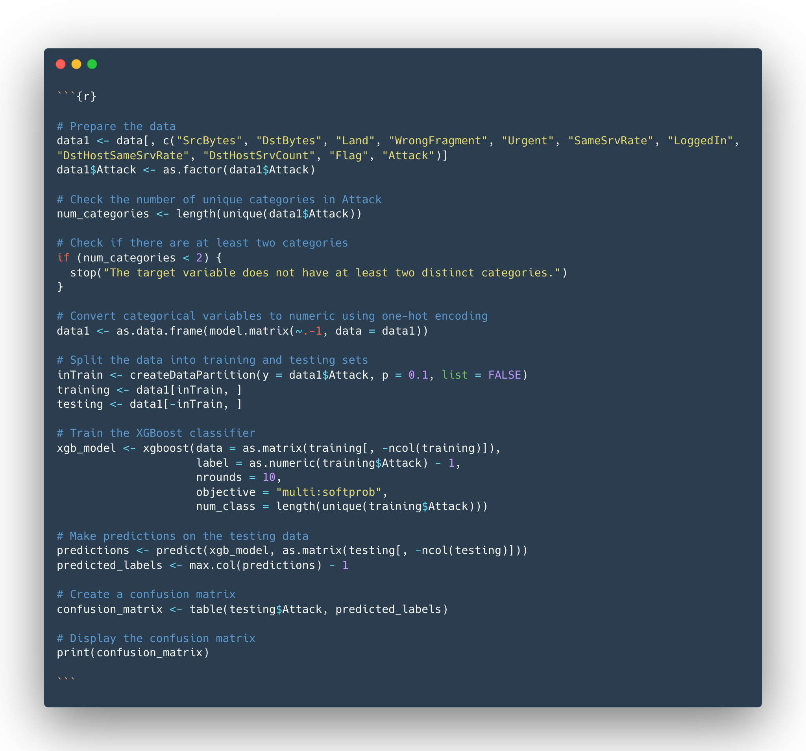
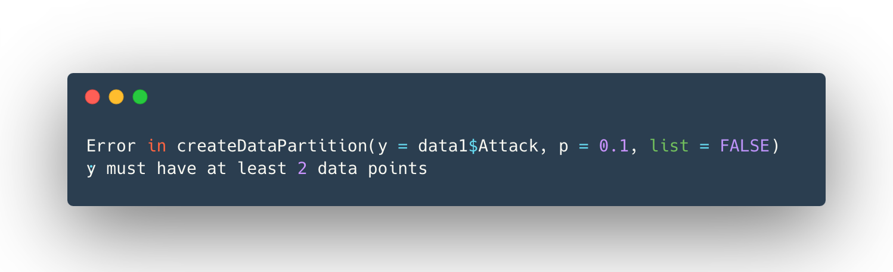
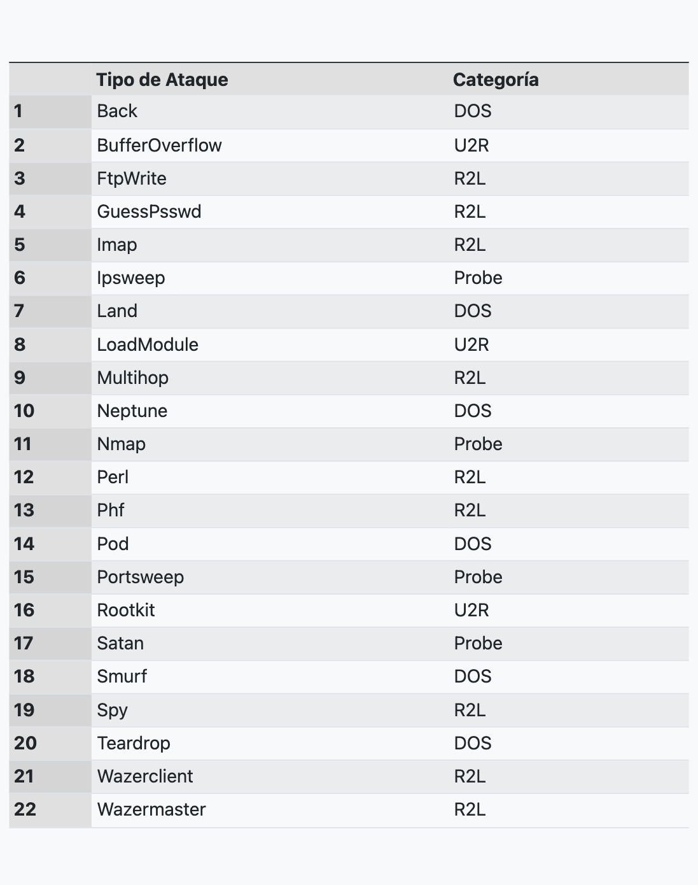
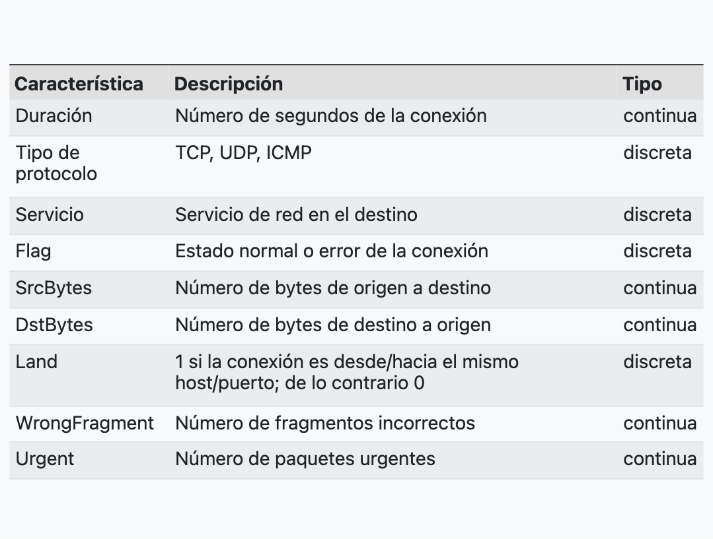
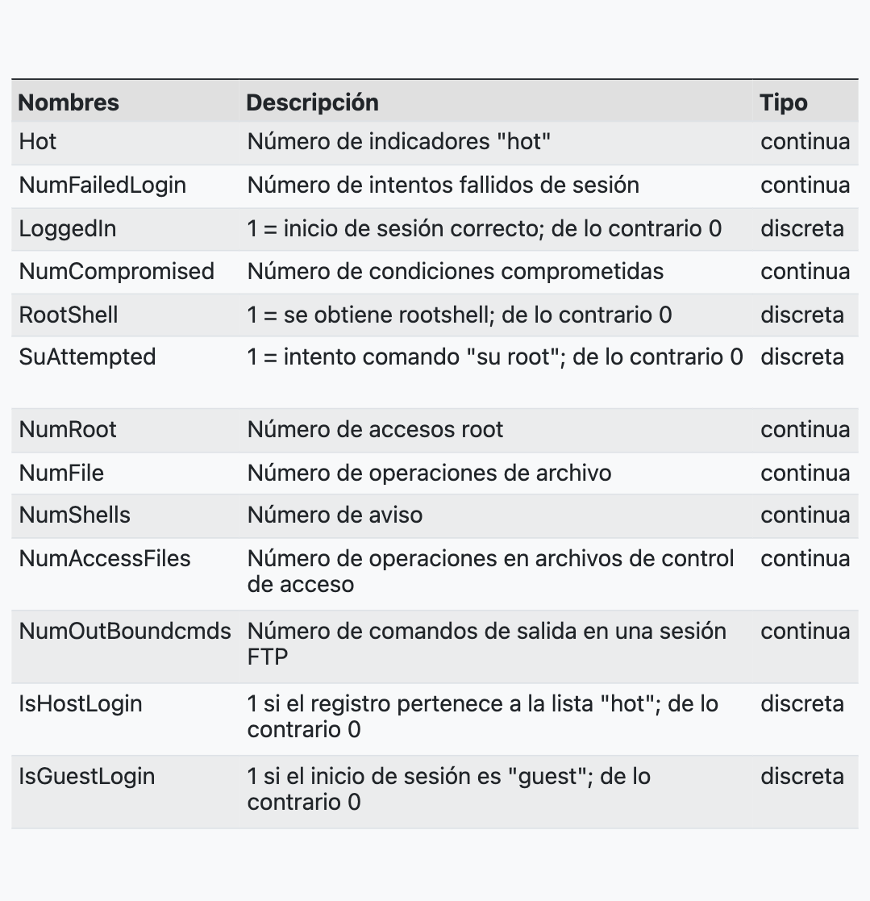
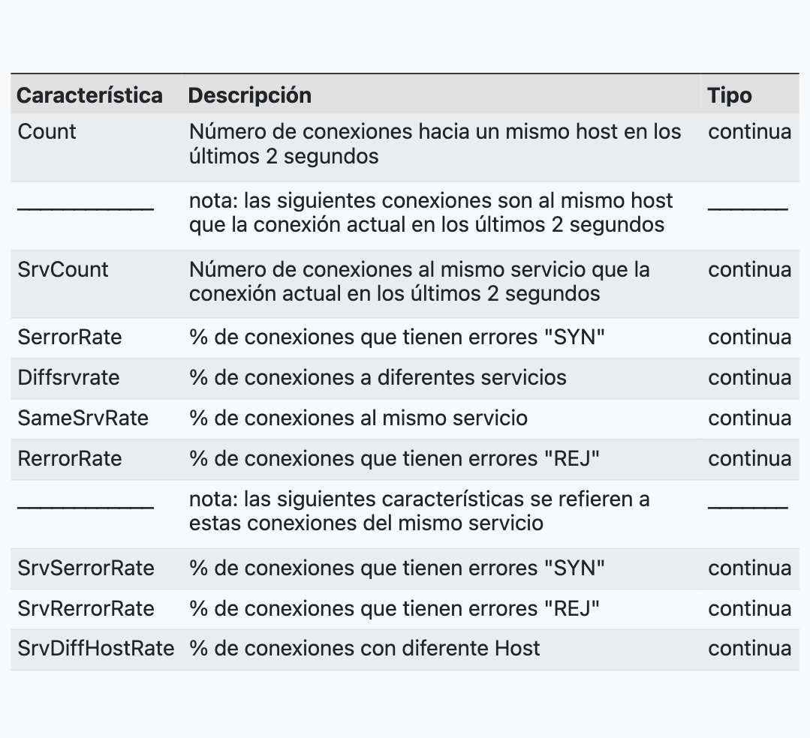
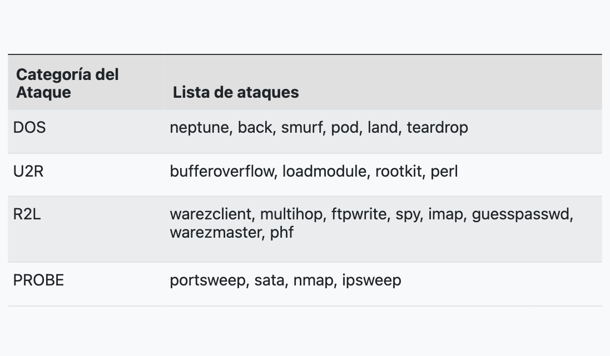
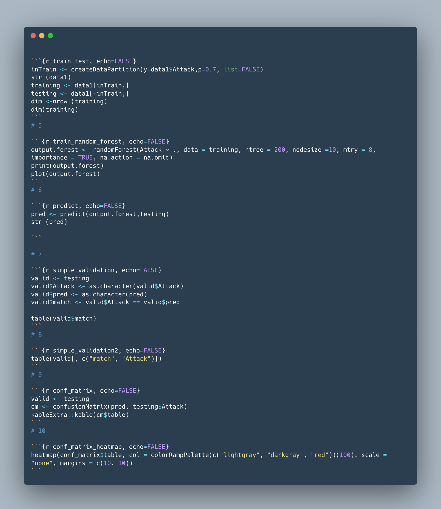
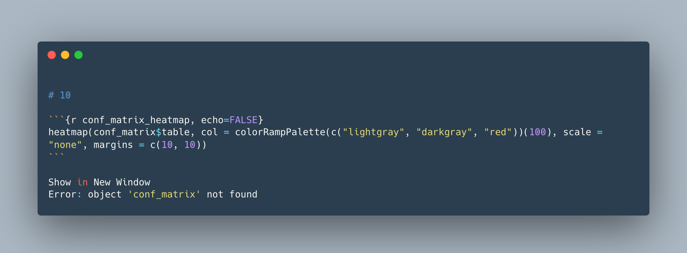

```{r setup, include=FALSE}
knitr::opts_chunk$set(echo = TRUE)

library(randomForest)
library(readr)
library(ggplot2)
library(treemap)
library(caret)
library(e1071)
library(kableExtra)
library(dplyr)
library(lubridate)
library(patchwork)
library(xgboost)
```

### Introducción

 Observando el documento **KDD Cup 99 Data Set** podemos determinar que hay columnas que proporcionan datos de mejor calidad mientras que otras, por la ausencia de datos dentro de estas mismas, no aportan absolutamente nada.
 Intentaremos explorar en R y tratar de visualizar los datos. La idea es poder entrenar un modelo de machine learning, experimentando con diferentes algoritmos de aprendizaje supervisado como Random Forest o Regresión Lineal y que estos nos permitan mejorar el actual rendimiento del modelo. 
 
 Desde ya podemos anticipar que el análisis en detalle de el comportamiento de la red en base al tiempo y la frecuencia de las conexiones nos permitirá entender a cabalidad dicho Data Set.
 
 
 
### Estructura del documento

**Planteamiento de Objetivos**

**1.** Metadatos del documento.

**2.** Objetivos del análisis.

**3.** Configuración de R y carga de librerías.

**Limpieza de Datos**

**4.** Protocolos de Internet - cantidad de conexiones.

**5.** Protocolos de Internet - tiempo de conexiones.

**6.** Clasificación de los tipos de ataque. Bar plot y Treemap plot.

**Entrenamiento y modelos**

**7.** Train-Test Split y modelo XGBoost.

**8.** Train-Test Split y modelo Random Forest.

**9.** Datos de Entrenamiento

**10.**Datos de prueba (test data set)	

**11.**Conclusión


### 2. Objetivos del análisis

En primera instancia, podemos encontrar dos posibles objetivos para esta práctica: 


  **a.	Clasificación de ataques**: Clasificar y categorizar los diferentes tipos de ataques presentes en el conjunto de datos del documento. 

  **b.	Detección de intrusión**: Identificar patrones y anomalías en el tráfico de red como tiempos de conexión que indiquen posibles ataques o intentos de acceso no autorizados. 
  
  **b.	Construir un sistema de detección de intrusión**: Construir un modelo predictivo que permita distinguir entre conexiones de red "buenas" y "malas" y que a su vez permita clasificar las conexiones "malas" identificadas en diferentes tipos de ataques. Sería genial si este sistema, de forma autónoma puede detectar ataques, ofrecer información sobre estos y además tomar medidas correctivas.

 
 
### 3. Configuración de R y carga de librerías



```{r read_data, echo=FALSE}
data_full <- read_csv("Book1.csv",
                  col_types = cols(SrcBytes = col_integer(),
                                   DstBytes = col_integer(),
                                   Land = col_integer(),
                                   WrongFragment = col_integer(),
                                   Urgent = col_number(),
                                   Hot = col_number(),
                                   NumFailedLogin = col_integer()))

data <- read.csv(file = "Book2.csv", header = TRUE)
```


### 4. Protocolos de Internet - cantidad de conexiones

 En este gráfico de dispersión tenemos como axis **x** a **SrvCount** , vale decir el número de conexiones realizadas al mismo servicio (o puerto) y en el axis **y** la columna **DstHostCount** que representa el número de conexiones realizadas al mismo host de destino (o dirección IP) en una ventana de tiempo determinada.

 El protocolo ICMP se utiliza principalmente con fines de diagnóstico y notificación de errores en la comunicación de red por lo que no debiera tener tantas conexiones múltiples a un mismo servicio, mientras que múltiples conexiones realizadas a la misma dirección IP utilizando el protocolo UDP podrían indicar actividades repetitivas como escaneo de puertos por ejemplo.
 

```{r, echo=FALSE}
ggplot(data) +
  aes(
    x = SrvCount,
    y = DstHostCount,
    fill = ProtocolType,
    colour = ProtocolType
  ) +
  geom_point(shape = "circle", size = 2.0) +
  scale_fill_hue(direction = 1) +
  scale_color_hue(direction = 1) +
  theme_minimal()
```


### 5. Protocolos de Internet - tiempo de conexiones

Un vez gráficadas la cantidad de las conexiones por protocolos, pensamos que también es necesario entender esta misma información pero base al tiempo que cada conexión ocupa separada por protocolos, es básicamente un analisis de la red que permite conocer la duración media de la conexión, el númeor total de bytes transmitidos y el total de paquetes entregados, todo separado por tipo el de protocolo utilizado.


```{r, echo=FALSE}

# Calculate average duration of the connection by protocol type
avg_duration <- data %>%
  group_by(ProtocolType) %>%
  summarize(avg_duration = mean(Duration))

# Calculate total bytes by protocol type
total_bytes <- data %>%
  group_by(ProtocolType) %>%
  summarize(total_bytes = sum(SrcBytes + DstBytes))

# Calculate total packets by protocol type
total_packets <- data %>%
  group_by(ProtocolType) %>%
  summarize(total_packets = sum(Count + SrvCount))

# Plotting average duration of the connection
ggplot(avg_duration, aes(x = ProtocolType, y = avg_duration)) +
  geom_bar(stat = "identity", fill = "steelblue") +
  labs(x = "Tipo de Protocolo", y = "Duración Media (ms)",
       title = "a. Duración media de la conexión por tipo de protocolo")

# Plotting total bytes by protocol type
ggplot(total_bytes, aes(x = ProtocolType, y = total_bytes)) +
  geom_bar(stat = "identity", fill = "steelblue") +
  labs(x = "Tipo de Protocolo", y = "Total de Bytes",
       title = "b. Total de Bytes por Tipo de Protocolo")

# Plotting total packets by protocol type
ggplot(total_packets, aes(x = ProtocolType, y = total_packets)) +
  geom_bar(stat = "identity", fill = "steelblue") +
  labs(x = "Tipo de Protocolo", y = "Total de Paquetes",
       title = "c. Total de Paquetes por Tipo de Protocolo")


```


### 6. Clasificación de los tipos de ataque

**a.** Tanto en este gráfico como en el siguiente, lo que tratamos de hacer fue visualizar de forma concreta los distintos tipos de ataques registrados en del documento.

```{r feature_selection, echo=FALSE}
data1 <- data[, c("SrcBytes", "DstBytes", "Land", "WrongFragment", "Urgent", "SameSrvRate", "LoggedIn", "DstHostSameSrvRate", "DstHostSrvCount", "Flag", "Attack")]
data1$Attack <- as.factor(data1$Attack)

attack_counts <- table(data$Attack)

# Convert the attack counts to a data frame for plotting
attack_df <- data.frame(Attack = names(attack_counts),
                        Count = as.numeric(attack_counts))

# Sort the attack types in descending order based on their counts
attack_df <- attack_df[order(attack_df$Count, decreasing = TRUE), ]

# Create the bar plot
bar_plot <- ggplot(attack_df, aes(x = reorder(Attack, -Count), y = Count, fill = Attack)) +
  geom_bar(stat = "identity") +
  labs(x = "Tipo de ataques", y = "Count", title = "Ranking de Ataques") +
  theme(axis.text.x = element_text(angle = 45, hjust = 1)) +
  coord_flip()

# Display the bar plot
print(bar_plot)

```


**b.** Una idea similar al gráfico anterior, esta vez utilizando un Treemap plot. Se pueden observar los diferentes tipos de ataques pero esta vez es más fácil poder dimensionar la cantidad de cada uno de estos.

```{r, echo=FALSE}
attack_counts_df <- data.frame(Attack = names(table(data1$Attack)),
                               Count = as.numeric(table(data1$Attack)))

# Create the treemap
treemap_plot <- treemap(attack_counts_df, index = "Attack", vSize = "Count", title = "Distribución de los ataques",
                        palette = "Set3", fontsize.labels = 12, 
                        fontsize.title = 12)

# Display the treemap
# print(treemap_plot)

```


### 7. Train-Test Split y modelo XGBoost.

En esta etapa, nuestra intención era utilizar el algoritmo de regresión **XGBoost**. La idea era utilizar la columna **Attack** como ingesta principal de información para el modelo que, utilizando una lógica binaria, pudiera clasificar los distintos tipos de atque de una forma más eficiente. Después de todo ese es el fuerte de los ordenadores.




Sin embargo, por falta de pericia en R, no logramos solucionar los más importante de todo que era convertir y/o reducir los tipos de ataques presentes en el data set en una lógica binaria de "buenos" y "malos". A continuación el error en específico.




### 8. Train-Test Split y modelo Random Forest.

**Interpretación de los datos**

En esta etapa, gran parte de la investigación consistió en realizar una investigación los books tratando de entender de que forma estos podrían estar relacionados. Si bien se pueden obtener agrupar eb base a un criterio de ciberseguridad, es necesario realizar pruebas en Rstudio para poder identificar diferencias en las distribuciones mediante gráficos.


**Sugerencia de agrupación de datos**

•	**Agrupación por protocolo y servicio**: Agrupar los eventos según el tipo de protocolo utilizado (por ejemplo, TCP, UDP) y el servicio asociado (por ejemplo, HTTP, FTP, SSH). Con la finalidad de detectar anomalías o patrones de comportamiento inusuales para cada combinación de protocolo y servicio. (figura 4.)


•	**Agrupación por duración**: Eventos de seguridad según la duración de las conexiones (podríamos usar estadísticas de duración: promedio, mediana, mínimo y máximo). Esto podría detectar eventos de seguridad que tienen una duración atípicamente larga o corta, lo cual puede ser indicativo de intentos de intrusión. (figura 5. a)


•	**Agrupación por patrones de tráfico**: analizando los datos de tráfico de red (como bytes enviados, errores de conexión) y agrupar los eventos de seguridad en función de patrones de tráfico inusuales. Podemos identificar actividades anómalas que no siguen el comportamiento típico de la red. (figura 5. b)


•	**Agrupación por tipo de ataque**: agrupar los eventos de seguridad según el tipo de ataque reportado. Utilizando el campo "Attack" para identificar y clasificar diferentes tipos de ataques (por ejemplo, DDoS, SQL Injection, Buffer Overflow). En base a esto podemos aplicar reglas de detección. (figura 6. a y b)


•	**Agrupación por estado de conexión**: Es posible agrupar los eventos de seguridad según el estado de la conexión reportado en el campo "Flag" (por ejemplo, establecido, cerrado, sincronización). Esto permite detectar cambios en el estado de la conexión que podrían indicar intentos de intrusión o actividad sospechosa.


### 9. Datos de Entrenamiento

 Logramos identificaron 4 categorías principales de ataque:
 
  a. DOS (Denegación de servicio)
  b. R2L (Acceso no autorizado desde una maquina remota)
  c. U2R (Accesso no autorizado a superusuario local)
  d. Vigilancia y otros sondeos (probing)
 
 
 - En la tabla de mas abajo se identifican 24 tipos de ataque en datos de entrenamiento:



### 10. Datos de prueba (test data set)	

 
  a. Registros de conexión sin etiqueta.
  b. 14 tipos de registros de ataques adicionales, además de los tipos “covered” en el dataset de entrenamiento.
  c. La mayoría de los ataques “novedosos” son variantes de ataques ya conocidos, por lo tanto, usaremos la signatura” del ataque conocido para obtener las variantes nuevas (novedosas).

 
 
 **1. Funciones básicas de TCP para conexión individual**


 
 **2. Funciones de contenido**



 **3. Funciones de trafico (Ventana de los 2 ultimos segundos)**
 
 

 **4. Clasificación**
 
 
 
### 11. Conclusión

>El desarrollo de un modelo de detección de intrusiones implica varias etapas clave, desde la recopilación y el procesamiento de datos hasta el entrenamiento de algoritmos como Random Forest y XGBoost. Durante este proceso, hemos identificado las siguientes consideraciones importantes: 
 
> a. La recopilación exhaustiva de datos de eventos de seguridad es fundamental para obtener un conjunto de datos sólido y representativo. Esta recopilación debe incluir los atributos   relevantes necesarios que permitan un análisis detallado. 
 
> b. El procesamiento de datos y la "limpieza" de estos desempeña un papel crucial en la        preparación de los datos para el entrenamiento del modelo. Esto implica la normalización de características, el manejo de valores faltantes y la codificación de variables categóricas, entre otros pasos. 
 
> c. Además, la agrupación de eventos en función de diferentes características, como el protocolo y el servicio, la duración, los patrones de tráfico y el tipo de ataque, resultaron ser datos claves para poder identificar patrones y anomalías en los datos. 
 
> d. El etiquetado de grupos según la mayoría de las etiquetas de los eventos contenidos en ellos permite clasificar los grupos como "buenos" o "malos", estableciendo así una lógica binaria para el modelo. 
 
> Aunque el proyecto no logró obtener un resultado práctico y visual, se ha comprendido la importancia de un adecuado procesamiento y análisis de los datos antes del entrenamiento. Esta comprensión es esencial para garantizar que el modelo pueda aprender correctamente y ofrecer resultados precisos. Se reconoce la posibilidad de realizar re-entrenamientos para mejorar el porcentaje de detección de intrusiones a medida que se obtienen nuevos datos y se ajustan los hiperparámetros del modelo. 
 
> En resumen, el desarrollo de un modelo de detección de intrusiones requiere una cuidadosa recopilación, procesamiento y análisis de los datos, seguido de un entrenamiento adecuado utilizando algoritmos como Random Forest y XGBoost. Estas etapas son fundamentales para lograr un modelo efectivo que pueda identificar intrusiones de manera confiable y contribuir a mejorar la seguridad de los sistemas.

**Código del modelo Random Forest y un error que no pudimos resolver: **
 
 
 

 
 
 
 
### Andres Valdez - Cesar Mella / 2023 - 06 - 05
### Gracias!
 
 
 
 
 
 
 
